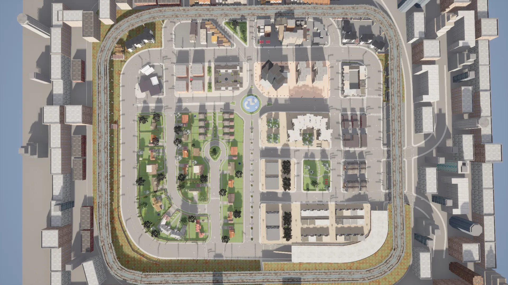
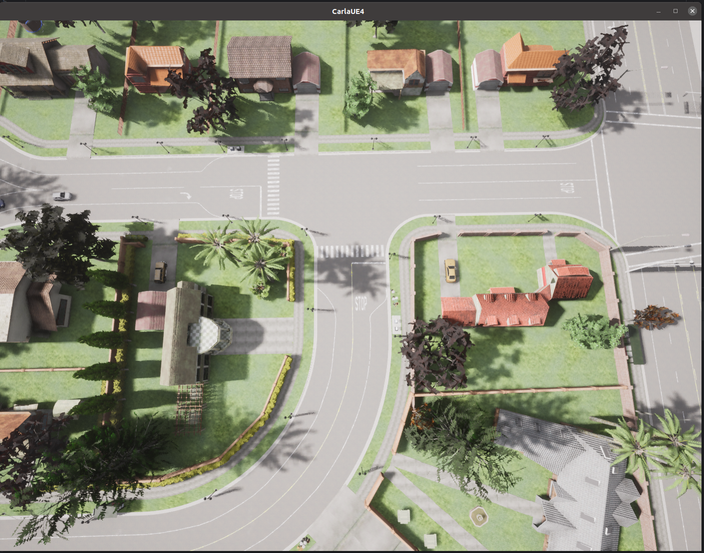
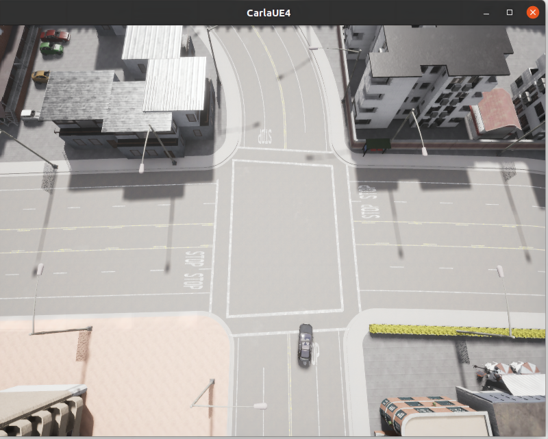
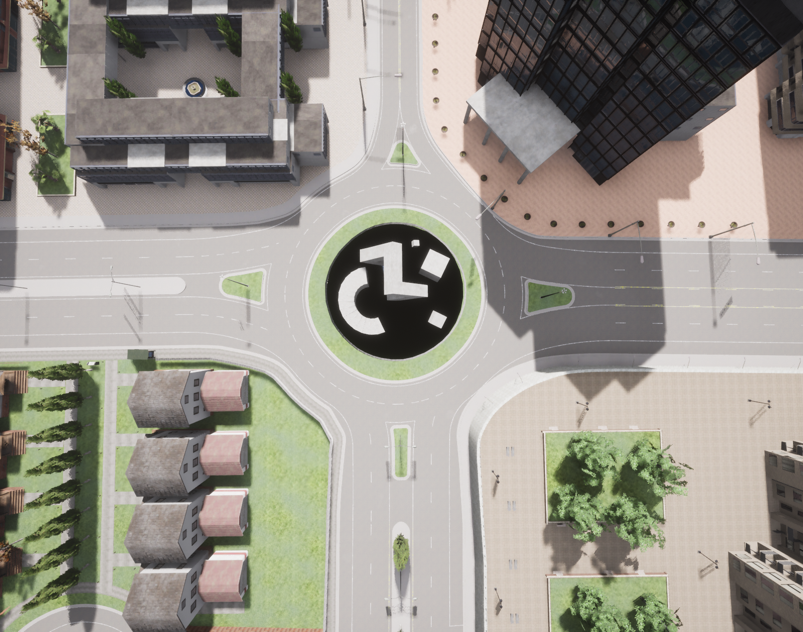

# Experiment Setup

## Road Structures
To validate the performance of AMACollision under diverse driving scenarios, we adopt three various road structures provided by the Town03 map of Carla, as detailed below:

Town 3 is a larger town with features of a downtown urban area. The map includes some interesting road network features such as a roundabout, T-Junction and Intersection. 

### **T-Junction**

A three-way intersection which requires precise maneuvering of the *AVUT* when merging or yielding, e.g., right-of-way conflicts.

### **Intersection** 

A classic four-way crossroads without traffic signals, including multiple conflict points which tests the *AVUT*'s ability to coordinate with other agents.

### **Roundabout**

This road introduces a circular segment, significantly increasing the complexity due to the need for continuous lane-following while managing entry, circulate and exit from the roundabout unpredictably.

## NPC Configurations

For all three road structures, we deploy three distinct NPC configurations to enhance the complexity and variability of testing conditions. Each NPC is assigned a unique starting position and destination. 

- **NPC  Configuration 1:**  including two four-wheeled vehicles (2V). 

- **NPC  Configuration 2:**  including two four-wheeled vehicles and one motorcycle (2V+1M). 

- **NPC  Configuration 3:**  including two four-wheeled vehicles, one motorcycle, and one pedestrian (2V+1M+1P).  

## Experiment Setup For Each RQ

- For **RQ1**, we select the second NPC configuration which includes two four-wheeled vehicles and one motorcycle(2V+1M). The speed limit for *AVUT*  is set to 5 m/s. We conduct experiments to compare the effectiveness of AMACollision with two baselines across all road structures.  

- For **RQ2**, we conduct comparative experiments using all three NPC configurations across each road structure. The speed limit for *AVUT*  is also set to 5 m/s. 

- For **RQ3**, we employ ten distinct speed limits for *AVUT*, ranging from 1 m/s to 10 m/s, in 1 m/s increments. The experiments for RQ3 are conducted on each speed limit, utilizing the second NPC configuration across all road structures. The *AVUT* is subjected to 500 testing episodes for each experiment.
