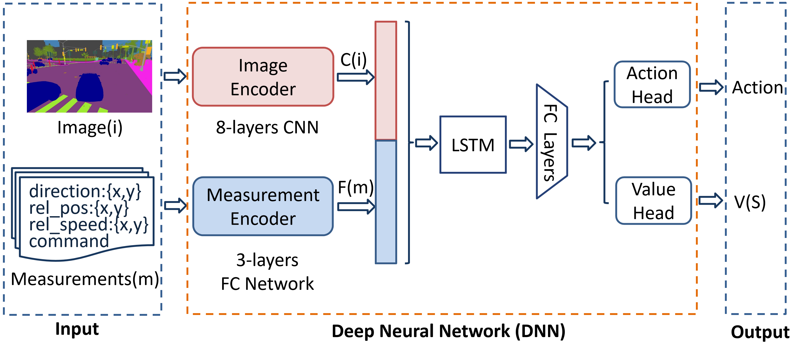
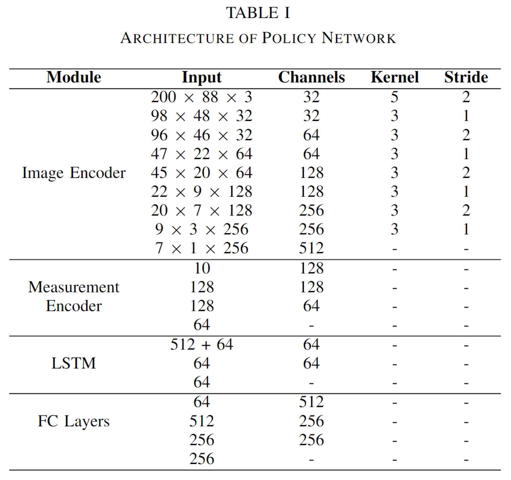
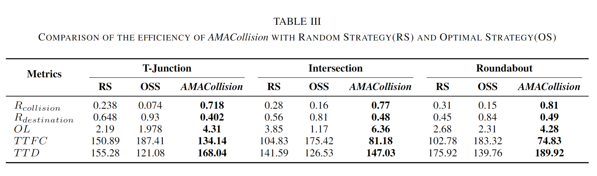
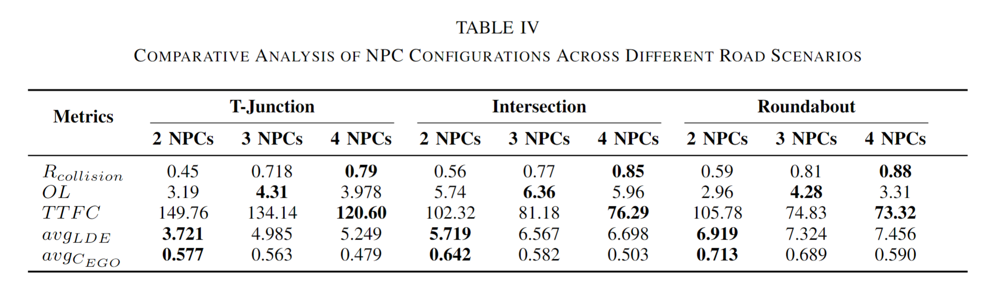
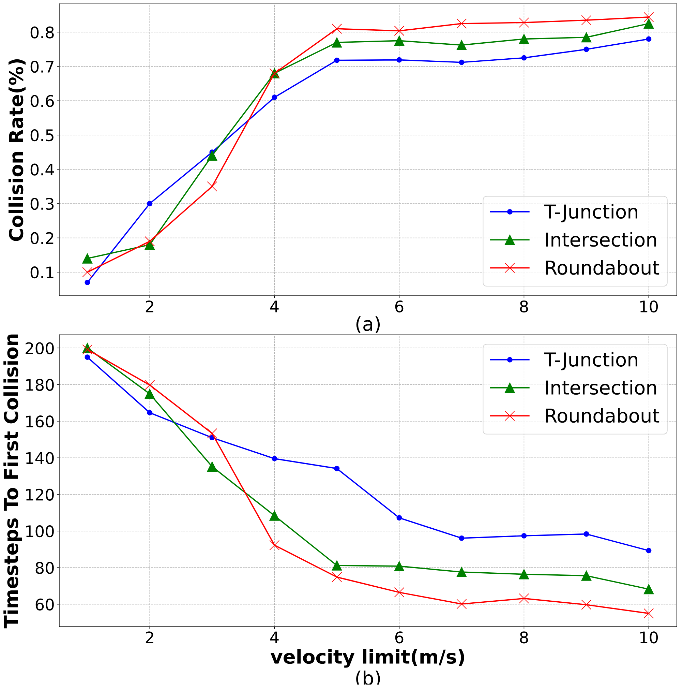

# AMACollision

This is a repository for the paper "AMACollision: An Advanced Framework for Testing Autonomous Vehicles Based on Adversarial Multi-Agent". **AMACollision** is a multi-agent adversarial testing platform built on top of the **Carla** Autonomous Driving simulator and Macad-Gym. 

Here is the overview of **AMACollision**:

As illustrated in the figure above, **AMACollision** is integrated with Carla to provide the simulated driving environment. At each timestep, the state information is extracted from the simulated driving environment and then undergoes the process of State Encoding. The reward is computed by Reward Function based on the encoded state information. We specially design a unified **AMA policy model** for each diverse adversarial agent. Each AMA policy model feeds back an action for corresponding NPC in the driving environment to control its behavior. To be specific, we consider three distinct kinds of diverse agents, i.e., four-wheeled vehicles, two-wheeled vehicles (including motorcycles and bicycles), and pedestrians. 

------

## NetWork Architecture
The AMA policy model leverages the following neural network architecture:

The parameters of the four modules in the AMA policy model are shown in Table below:

------

## Experiments and Results
For all three road structures, we deploy three distinct NPC configurations (e.g., the number and type of NPCs) to enhance the complexity and variability of testing conditions. The first configuration comprises two four-wheeled vehicles. The second configuration adds one extra motorcycle to the first configuration. The third configuration is expanded to including two four-wheeled vehicles, one motorcycle, and one pedestrian. Each NPC is assigned a unique starting position and destination. The detailed NPC configurations are presented in  [Here](https://github.com/alanshuo123/AMACollision/blob/main/doc/experimentSetup.md).

### Results for RQ1
We measure the effectiveness of **AMACollision** in exposing failures of the *AVUT* in terms of five metrics: $R_{collision}$, $R_{destination}$, $OL$, $TTFC$ and $TTD$. We ran each baseline 500 episodes, with 200 simulation timesteps in each episode, and computed the average value for $OL$, $TTFC$ and $TTD$ of all 500 episodes.

### Results for RQ2
we conduct comparative experiments using all three NPC configurations across each road structure. 

### Results for RQ3
The experiments for RQ3 are conducted on each speed limit, utilizing the second NPC configuration across all road structures. The primary metrics for RQ3 are $R_{Collision}$, and $TTFC$.

------

## Getting Started

1. Install the system requirements:
   
    - Ubuntu 18.04/20.04/22.04 or later
	
	- Anaconda (latest version)
	
2. Setup Carla(0.9.13):

    - Run `mkdir ~/software && cd ~/software`
    - Download the 0.9.13 release version from: [Here](https://github.com/carla-simulator/carla/releases) Extract it into `~/software/CARLA_0.9.13`
    - Run `echo "export CARLA_SERVER=${HOME}/software/CARLA_0.9.4/CarlaUE4.sh" >> ~/.bashrc`

3. Install AMACollision:

   - Fork/Clone the repository to your workspace:
     `git clone https://github.com/alanshuo123/AMACollision.git && cd AMACollision`

   - Create a new conda env and install the required packages:
     `conda env create -f conda_env.yml`

   - Activate the environment:
     `conda activate AMACollision`

   - Run the following commands in sequence for installing rest of the packages to avoid version errors:

     `pip install --upgrade pip`

     `pip install -e .` 

     `pip install tensorflow==1.15.0`

     `pip install tensorflow-gpu==1.15.0`

     `pip install pip install ray[tune]==0.8.4`

     `pip install pip install ray[rllib]==0.8.4`

     `pip install tf_slim`

     `pip install tensorboardX==1.15`
