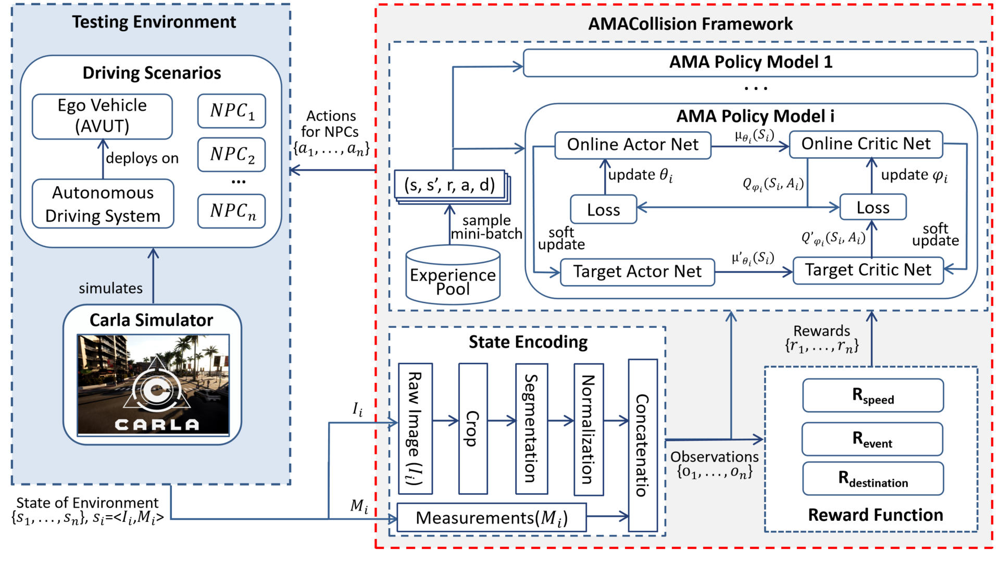

# AMACollision

This is a repository for the paper "AMACollision: An Advanced Framework for Testing Autonomous Vehicles Based on Adversarial Multi-Agent".

AMACollision is a multi-agent adversarial testing platform built on top of the Carla Autonomous Driving simulator and Macad-Gym.

As illustrated in figure above, AMACollision is integrated with Carla to provide the simulated driving environment. At each timestep, the state information is extracted from the simulated driving environment and then undergoes the process of State Encoding. The reward is computed by Reward Function based on the encoded state information. We specially design a unified AMA policy model for each diverse adversarial agent. Each AMA policy model feeds back an action for corresponding NPC in the driving environment to control its behavior. To be specific, we consider three distinct kinds of diverse agents, i.e., four-wheeled vehicles, two-wheeled vehicles (including motorcycles and bicycles), and pedestrians. 

------

## NetWork Architecture
The AMA policy model leverages the following neural network architecture:

The parameters of the four modules in the AMA policy model are shown in Table below:

------

## Results

All agents were evaluated on six metrics (*collision rate, similarity, speed, waypoint distance, total reward, and timesteps*), two disjoint weather sets (only one used during training), over all CARLA towns (from `Town01` to `Town10`) but only trained on `Town03`.

------

## Getting Started

1. Install the system requirements:
   
    - Ubuntu 18.04/20.04/22.04 or later
	
	- Anaconda (latest version)
	
2. Setup Carla(0.9.13):

    - Run `mkdir ~/software && cd ~/software`
    - Download the 0.9.13 release version from: [Here](https://github.com/carla-simulator/carla/releases) Extract it into `~/software/CARLA_0.9.13`
    - Run `echo "export CARLA_SERVER=${HOME}/software/CARLA_0.9.4/CarlaUE4.sh" >> ~/.bashrc`

3. Install AMACollision:

   - Fork/Clone the repository to your workspace:
     `git clone https://github.com/alanshuo123/AMACollision.git && cd AMACollision`

   - Create a new conda env and install the required packages:
     `conda env create -f conda_env.yml`

   - Activate the environment:
     `conda activate AMACollision`

   - Run the following commands in sequence for installing rest of the packages to avoid version errors:

     `pip install --upgrade pip`

     `pip install -e .` 

     `pip install tensorflow==1.15.0`

     `pip install tensorflow-gpu==1.15.0`

     `pip install pip install ray[tune]==0.8.4`

     `pip install pip install ray[rllib]==0.8.4`

     `pip install tf_slim`

     `pip install tensorboardX==1.15`
